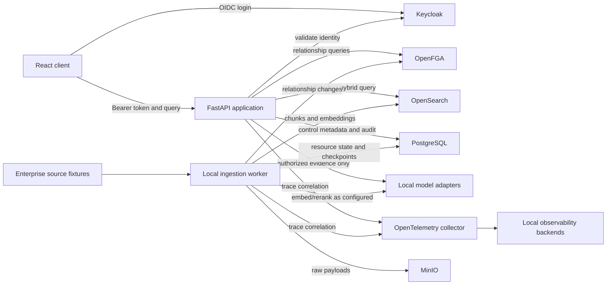

# Reference Architecture

- Phase: P02
- Status: accepted reference architecture; no business implementation
- Deployment: local-only Docker Compose
- Architectural style: modular monolith with ports and adapters, plus a separate
  local ingestion worker

## 1. Architecture goals

The architecture must preserve authorization before model-facing processing,
tenant isolation, dynamic revocation without re-embedding, deterministic
citations, source lineage, deletion propagation, local operation, and clear
dependency boundaries. It should remain small enough for one team to operate
while allowing infrastructure adapters to be replaced behind typed ports.

## 2. Selected stack

| Concern | Selected component | Responsibility |
|---|---|---|
| Web API | Python, FastAPI, strict static typing | Authentication boundary, use-case orchestration, typed API contracts, health/readiness endpoints |
| Web client | React with TypeScript strict mode | Query, evidence, refusal, warning, and audit-safe user experience; never an authorization authority |
| Control data | PostgreSQL | Resource/revision metadata, ingestion jobs/checkpoints, lifecycle state, configuration references, version registries, and durable audit metadata |
| Hybrid retrieval | OpenSearch | BM25, vector search, hybrid ranking inputs, server-generated metadata filtering, and text-bearing searchable derivatives |
| Relationship authorization | OpenFGA | Source of truth for tenant, department, account, role, explicit grant, view, and external-share relationships |
| Identity provider | Keycloak | Local OIDC authentication, session lifecycle, user/group identity claims, and administrative identity management |
| Raw object storage | MinIO | Original source payloads and attachments with provenance, quarantine, lifecycle, and integrity metadata |
| Ingestion execution | Local Python worker | Durable job leasing, connector execution, parsing, normalization, indexing, deletion/change processing, and checkpoints |
| Model boundary | Local LLM, embedding, and reranker adapters | Configuration-selected local model invocation behind typed interfaces |
| Observability | OpenTelemetry | Trace context and correlation across API, worker, policy, search, storage, and model boundaries |
| Local orchestration | Docker Compose | Reproducible service topology, networks, volumes, health checks, and local startup/shutdown |

Redis is not part of the initial architecture. PostgreSQL provides durable job
and checkpoint state, and request-local data structures provide the initial
query cache behavior. A future ADR may introduce Redis only for a measured queue
or cache requirement with tenant-aware keys, policy-version binding,
revocation/deletion invalidation, and failure tests.

## 3. Component view

The diagram is a logical deployment view. It does not grant direct network
access: the browser reaches only the frontend/API and Keycloak login endpoints;
the local model process receives only adapter requests; infrastructure services
are on private Compose networks unless an operator port is explicitly enabled.

## 4. Application modules

### API process

The API verifies Keycloak-issued OIDC tokens, constructs a server-owned
principal, invokes application use cases, and serializes typed responses. It
does not embed infrastructure policy in route handlers. Authentication success
is necessary but not sufficient for resource access.

### Query application service

The query use case coordinates authorization scope, metadata-first hybrid
retrieval, candidate fine checks, authorized text fetch, reranking, evidence
resolution, context construction, model generation, citation validation,
shareability warnings or enforcement, and audit emission. It owns orchestration,
not infrastructure-specific query syntax.

### Ingestion worker

The worker leases durable jobs from PostgreSQL, writes raw source revisions to
MinIO, invokes parser and chunker ports, derives deterministic metadata,
synchronizes OpenFGA relationships, invokes the configured embedder, updates an
OpenSearch versioned index, and commits a checkpoint only after required steps
succeed. Failed stages are visible and retryable; protected states do not fail
open.

### Lifecycle service

Deletion, de-permissioning, source revisions, and relationship changes are
explicit use cases. They update lifecycle truth and invalidate derivatives;
they are not incidental side effects of a later query.

### Evidence and answer service

The evidence resolver applies deterministic authority, freshness,
supersession, conflict, and sufficiency rules to authorized chunks. The context
builder accepts only authorized evidence values. The LLM produces an untrusted
draft. Citation and output policy validators accept, qualify, redact, or refuse
before any user or external audience receives the answer.

## 5. Data ownership

| Store | Authoritative for | Explicitly not authoritative for |
|---|---|---|
| Keycloak | User authentication, OIDC session, identity/group claims | Resource authorization, answer shareability, source classification |
| OpenFGA | Current relationship tuples and authorization model used for `can_view` and `can_share_externally` | Source content, embeddings, source lifecycle, model output |
| PostgreSQL | Resource/revision registry, tenant/account metadata, lifecycle and job/checkpoint state, schema/version registries, durable audit event metadata | Semantic similarity or relationship authorization truth |
| MinIO | Raw source objects and attachment bytes plus integrity/provenance metadata | Search eligibility or view/share decisions |
| OpenSearch | Versioned searchable chunk derivatives, BM25 fields, vectors, filter metadata, and candidate scores | Final authorization, source-of-record lifecycle, identity |
| Local model runtime | Model execution for configured adapter requests | Authorization, classification, evidence identity, citation validity |

Every store repeats `tenant_id` where relevant as defense in depth, but repeated
metadata never replaces OpenFGA relationship truth or the PostgreSQL lifecycle
record. Conflicts among security-critical stores fail closed and emit an audit
event.

## 6. Deployment topology and network policy

Docker Compose defines separate logical networks:

- `edge`: frontend, API, and Keycloak endpoints needed by the browser.
- `control`: API/worker access to PostgreSQL and OpenFGA.
- `knowledge`: API/worker access to OpenSearch and MinIO.
- `model`: API/worker access to local model endpoints.
- `observability`: services exporting telemetry to the local collector.

Only the API and worker receive credentials for the stores they need. The
frontend receives no database, OpenSearch, MinIO, or OpenFGA credentials. Model
containers receive no source-store or authorization credentials. Parser work
runs with bounded resources and no arbitrary network access. Compose secrets or
local secret files are injected at runtime and never committed.

## 7. Failure posture

- Keycloak token validation failure: reject the request.
- OpenFGA unavailable, ambiguous, or stale beyond policy: return a generic
  protected-path refusal and emit an operator-visible reason.
- OpenSearch unavailable: no answer from hidden caches; return bounded
  unavailable/insufficient-evidence behavior.
- Candidate fine check unavailable: discard all affected candidates.
- Model unavailable or malformed output: return a bounded failure/refusal; do
  not bypass citation or sharing validation.
- PostgreSQL lifecycle conflict or deletion-in-progress state: resource is not
  eligible for search/content fetch.
- Audit sink failure on a security-required event: fail the protected operation
  or durably queue the event under an explicitly tested policy; never silently
  omit it.

## 8. Observability and audit

OpenTelemetry propagates a correlation context across API, worker, OpenFGA,
OpenSearch, PostgreSQL, MinIO, and model adapter calls. Operational telemetry is
not the durable audit record. The audit port stores minimized typed events with
principal ID, tenant ID, policy/model/schema versions, decision reason codes,
evidence IDs, timing, and outcome. Raw chunks, complete prompts, credentials,
tokens, and restricted answer text are excluded by default.

## 9. Deferred decisions

P02 does not choose concrete local model names, embedding dimensions, chunk
sizes, hybrid weighting, parser libraries, exact OpenFGA tuples, PostgreSQL
schema details, OpenSearch mappings, frontend state libraries, or observability
backends. Those require measured comparison or implementation-phase evidence.
